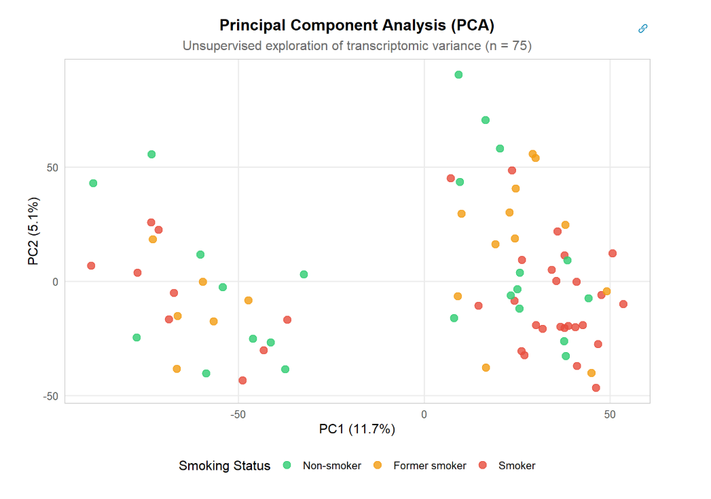
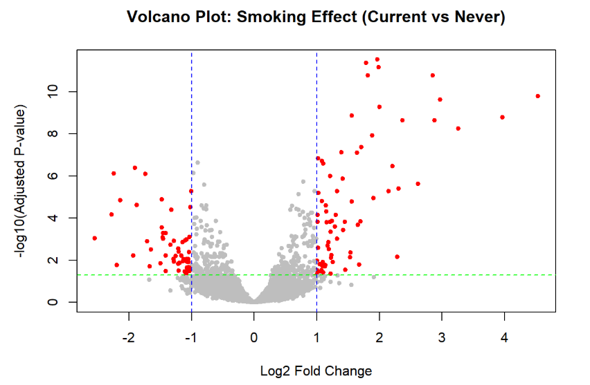

# Smoking-Associated Airway Epithelial Gene Expression Analysis (GSE994)

## Overview

This project presents a transcriptomic re-analysis of the landmark study:

**Spira et al. (2004)**  
*"Effects of cigarette smoke on the human airway epithelial cell transcriptome"*  
DOI: [10.1073/pnas.0401422101](https://doi.org/10.1073/pnas.0401422101)

The objective of this report is to reproduce and extend the original findings by investigating how cigarette smoking alters airway epithelial gene expression, and whether these molecular changes persist after smoking cessation.

---
## Results preview

### Principal Component Analysis



Smoking status contributes to transcriptomic variation but does not represent the dominant source of global variability.

### Differential expression analysis



Genome-wide differential expression analysis identifies a robust smoking-associated molecular signature.

---

## Dataset

Source: GEO (Gene Expression Omnibus)

Accession number: GSE994

Samples:
- Current smokers
- Former smokers
- Never smokers

Total samples: 75

Features: 22,215 probe sets

---

## Repository structure

## Repository structure

```text
├── code/
│   └── GSE994_Smoking_Transcriptome_Analysis.qmd
├── figures/
│   ├── PCA_plot.png
│   ├── Reanalysis_1_figure_comparison.png
│   ├── Reanalysis_2_figure_comparison.png
│   └── volcano_plot.png
├── original_paper/
│   └── spira-et-al-2004-effects-of-cigarette-smoke-on-the-human-airway-epithelial-cell-transcriptome.pdf
├── presentation/
│   └── GSE994_Project_presentation.pdf
├── report/
│   └── Report.pdf
├── README.md
└── LICENSE
```
---

## Main analyses

### 1. Exploratory Data Analysis

The dataset structure and global transcriptomic variability were investigated using:

- Expression distribution analysis
- Principal Component Analysis (PCA)
- Hierarchical clustering
- Gene variability analysis

These analyses evaluate whether smoking status explains the major sources of transcriptomic variation.

---

### 2. Identification of smoking-associated gene expression changes

Current smokers were compared with never smokers using two complementary approaches:

- Classical Student's t-test with permutation-based significance estimation
- **limma** empirical Bayes differential expression analysis

The resulting gene signatures were evaluated using:

- Hierarchical clustering
- Signature overlap analysis
- Comparison with the original 2004 study

---

### 3. Persistence of smoking-induced alterations

Former smokers were incorporated to investigate whether smoking-associated transcriptional changes remain after cessation.

The analysis identifies genes showing persistent alterations between:

- Former smokers
- Never smokers

and compares results between:

- Historical statistical approaches
- Modern statistical pipelines

---

### 4. Volcano plot analysis

A complementary genome-wide differential expression analysis was performed using limma.

The volcano plot integrates:

- Statistical significance
- Biological effect size (log2 fold change)

to visualize smoking-associated transcriptomic changes across the complete dataset.

---

## Main findings

- Smoking status does not explain the largest global transcriptomic variation, which appears driven by individual biological variability and potential confounding factors.
- Differential expression analysis identifies a robust smoking-associated molecular signature.
- Modern statistical approaches (limma and t-test based methods) recover highly concordant gene sets.
- Several smoking-induced transcriptional changes persist after cessation, suggesting a long-lasting molecular imprint.

---

## Report

The complete analysis is available in:

- `Report.html`

GitHub may not render large HTML files directly.
Download the repository and open the file locally in a web browser.

---

## Reproducing the analysis

Requirements:

- R >= 4.3
- Bioconductor
- limma
- GEOquery
- tidyverse

Clone the repository:

git clone https://github.com/Mateus-Auza/omics-project.git

To reproduce the report:

```bash
quarto render code/GSE994_Smoking_Transcriptome_Analysis.qmd
```
---

## Authors

**Auza Cruz Mateus**  
**Napolitano Dorian**

Project completed as part of the LSTAT2340 coursework at Uclouvain.

Completed: May 2026

---

## Tools and methods

Analysis performed using:

- R / Bioconductor
- limma
- Differential expression analysis
- PCA
- Hierarchical clustering
- Transcriptomic visualization methods

---
